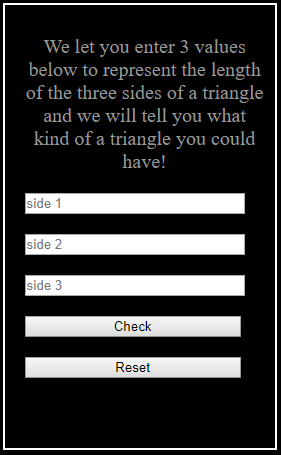

# Triangle Tracker

## Description
This is a program that allows users to enter three values each representing the length of a side of a possible triangle. The program checks the values and evaluates if they will form a scalene, isosceles, equilateral or no triangle at all. Below are specifications and sample inputs and outputs to explain the program's expected behaviour:

##Specifications of how it should work
  ###program returns error if no values are entered
      Example input: ,,,
      Example output: "You're required to enter a positive number!"
  ###program returns error if zero is entered
      Example input: 3,0,5
      Example output: "You must enter a number greater than zero!"
  ###program returns error if negative numbers are entered
      Example input: -4,5,3
      Example output: "You're required to enter a positive number!"
  ###program returns error if non numerical numbers are entered
      Example input: c,r,b
      Example output: no response from the keyboard
  ###program returns equilateral triangle if a user enters all equal lengths
      Example input:7,7,7
      Example output: "This will form an equilateral triangle"
  ###program returns isosceles triangle if a user enters two equal lengths
      Example input:7,7,6
      Example output: "This will form an isosceles triangle"
  ###program returns scalene triangle if a user enters all unequal lengths
      Example input:3,4,5
      Example output: "This will form a scalene triangle"
  ###program returns not a triangle if sum of any two sides is equal to a third
      Example input:7,3,4
      Example output: "This will not form a triangle"
  ###program returns not a triangle if sum of any two sides is less than a third
      Example input:3,4,100
      Example output: "This will not form a triangle"
  

## Getting started
This page gives the user an interface where they can enter input (the three sides of a triangle). They can then click the button 'Check' to check if they can form a triangle with the values presented and if so, it tells them the kind of triangle they can form. The interface also gives a picture of that type of triangle. If they cannot form a triangle, they get a sad face :(

The user is also able to click the reset button to clear all the fields.

### Built With
VSCode for HTML, CSS and JavaScript

Here is a link to the site: https://mopiata.github.io/triangle-tracker/

#### Author
Margaret Opiata-Mutungi

#### Contributors
Samuel Ngigi (My instructor)

#### License
This project is licensed under the MIT License.

##### 28th March 2019.
